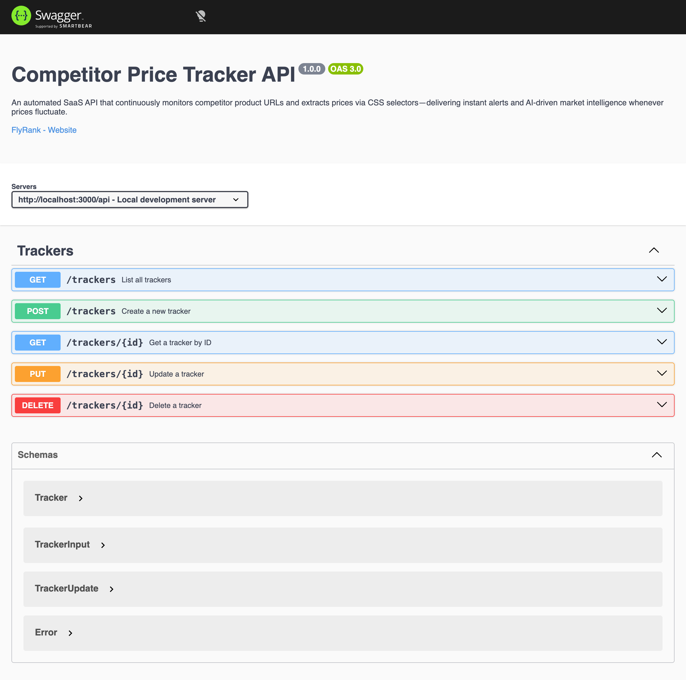

# Competitor Price Tracker API

An automated, lightweight SaaS API that continuously monitors competitor product URLs and extracts prices via CSS selectors — delivering instant alerts and AI-driven market intelligence whenever prices fluctuate.

## Business Proposal

**Problem:** E-commerce store owners, digital marketers, and pricing analysts waste hours manually visiting competitor websites daily to track price drops, stock updates, and promotional strategy shifts.

**Solution:** A RESTful API that lets users register competitor product URLs with CSS selectors, configure monitoring frequency, and manage tracking targets — all through a clean, layered MVC architecture.

**Target Audience:** E-commerce merchants, agency account managers, and market intelligence teams.

## Tech Stack

- **Runtime:** Node.js (ES Modules)
- **Framework:** Express 5
- **Documentation:** Swagger UI (OpenAPI 3.0)
- **Architecture:** Controller → Service → Repository (MVC Layered)
- **Storage:** In-memory (no database yet)

## Quick Start

```bash
# 1. Install dependencies
npm install

# 2. (Optional) Configure environment
cp .env.example .env

# 3. Start the development server
npm run dev
```

The server starts on `http://localhost:3000`.

- **API base URL:** `http://localhost:3000/api/trackers`
- **Swagger UI:** `http://localhost:3000/docs`

## Architecture

```text
src/
├── controllers/
│   └── trackerController.js    # Receives HTTP requests, calls Service, returns status codes
├── services/
│   └── tracker.Service.js      # Business rules & validation
├── repositories/
│   └── tracker.Repository.js   # Manages in-memory array data
├── routes/
│   └── trackerRouter.js        # Defines URL paths & HTTP verbs
├── middlewares/
│   └── errorHandler.js         # Centralized error handling
├── error.js                    # Custom error classes (ValidationError, NotFoundError)
└── app.js                      # Express app configuration
```

## Endpoint Reference

| CRUD Operation | Method | Endpoint | Success Status | Error Status |
| --- | --- | --- | --- | --- |
| Read All | GET | `/api/trackers` | 200 OK | 500 Server Error |
| Read Single | GET | `/api/trackers/:id` | 200 OK | 404 Not Found |
| Create | POST | `/api/trackers` | 201 Created | 400 Bad Request |
| Update | PUT | `/api/trackers/:id` | 200 OK | 400 Bad Request / 404 Not Found |
| Delete | DELETE | `/api/trackers/:id` | 204 No Content | 404 Not Found |
| Swagger UI | GET | `/docs` | 200 OK | — |

## Sample curl Output

### GET /api/trackers — List all trackers

```bash
curl -i http://localhost:3000/api/trackers
```

```http
HTTP/1.1 200 OK
Content-Type: application/json; charset=utf-8

[
  {"id":1,"name":"Tech Store Headphones","url":"https://site1.com/p1","targetSelector":".price","frequency":"daily","status":"active"},
  {"id":2,"name":"Marketplace Monitor","url":"https://site2.com/p2","targetSelector":"#price-tag","frequency":"hourly","status":"active"},
  {"id":3,"name":"Boutique Retailer","url":"https://site3.com/p3","targetSelector":"span.amount","frequency":"weekly","status":"paused"}
]
```

### GET /api/trackers/1 — Get single tracker

```bash
curl -i http://localhost:3000/api/trackers/1
```

```http
HTTP/1.1 200 OK
Content-Type: application/json; charset=utf-8

{"id":1,"name":"Tech Store Headphones","url":"https://site1.com/p1","targetSelector":".price","frequency":"daily","status":"active"}
```

### GET /api/trackers/99 — Tracker not found

```bash
curl -i http://localhost:3000/api/trackers/99
```

```http
HTTP/1.1 404 Not Found
Content-Type: application/json; charset=utf-8

{"error":"Tracker 99 not found"}
```

### POST /api/trackers — Create a tracker

```bash
curl -i -X POST http://localhost:3000/api/trackers \
  -H "Content-Type: application/json" \
  -d '{"name":"New Tracker","url":"https://example.com/p1","targetSelector":".price"}'
```

```http
HTTP/1.1 201 Created
Content-Type: application/json; charset=utf-8

{"id":4,"name":"New Tracker","url":"https://example.com/p1","targetSelector":".price","frequency":"daily","status":"active"}
```

### POST /api/trackers — Validation error (empty body)

```bash
curl -i -X POST http://localhost:3000/api/trackers \
  -H "Content-Type: application/json" \
  -d '{}'
```

```http
HTTP/1.1 400 Bad Request
Content-Type: application/json; charset=utf-8

{"error":"Name is required"}
```

### PUT /api/trackers/1 — Update a tracker

```bash
curl -i -X PUT http://localhost:3000/api/trackers/1 \
  -H "Content-Type: application/json" \
  -d '{"name":"Updated Tracker"}'
```

```http
HTTP/1.1 200 OK
Content-Type: application/json; charset=utf-8

{"id":1,"name":"Updated Tracker","url":"https://site1.com/p1","targetSelector":".price","frequency":"daily","status":"active"}
```

### DELETE /api/trackers/1 — Delete a tracker

```bash
curl -i -X DELETE http://localhost:3000/api/trackers/1
```

```http
HTTP/1.1 204 No Content
```

## Swagger UI

Interactive API documentation is available at `http://localhost:3000/docs` after starting the server.



## Seed Data

The API starts with 3 pre-filled trackers:

| id | name | url | targetSelector | frequency | status |
| --- | --- | --- | --- | --- | --- |
| 1 | Tech Store Headphones | `https://site1.com/p1` | `.price` | daily | active |
| 2 | Marketplace Monitor | `https://site2.com/p2` | `#price-tag` | hourly | active |
| 3 | Boutique Retailer | `https://site3.com/p3` | `span.amount` | weekly | paused |

## License

MIT
