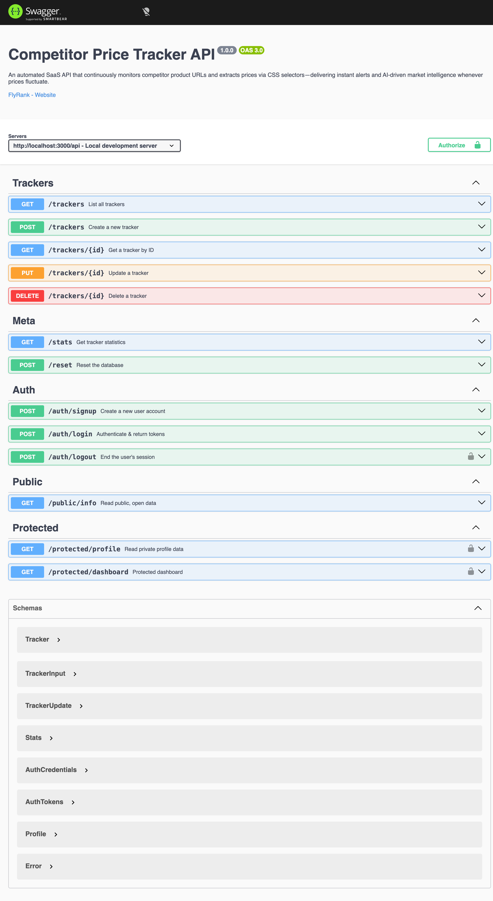

# Competitor Price Tracker API

An automated, lightweight SaaS API that continuously monitors competitor product URLs and extracts prices via CSS selectors — delivering instant alerts and AI-driven market intelligence whenever prices fluctuate.

## Business Proposal

**Problem:** E-commerce store owners, digital marketers, and pricing analysts waste hours manually visiting competitor websites daily to track price drops, stock updates, and promotional strategy shifts.

**Solution:** A RESTful API that lets users register competitor product URLs with CSS selectors, configure monitoring frequency, and manage tracking targets — all through a clean, layered MVC architecture.

**Target Audience:** E-commerce merchants, agency account managers, and market intelligence teams.

## Tech Stack

| Layer | Technology |
|-------|-----------|
| Runtime | Node.js (ES Modules) |
| Framework | Express 5 |
| Documentation | Swagger UI (OpenAPI 3.0) |
| Architecture | Controller → Service → Repository (MVC Layered) |
| Storage | PostgreSQL 17 (containerized, persistent via named volume) |
| Infrastructure | Docker + Docker Compose (multi-stage build) |
| Auth (W4) | Supabase Auth — `@supabase/supabase-js` v2, JWT bearer verification |

## Quick Start

```bash
cp .env.example .env          # fill in your values
docker compose up -d --build  # app + Postgres
```

- **API base URL:** `http://localhost:3000/api/trackers`
- **Swagger UI:** `http://localhost:3000/docs`
- **Health check:** `http://localhost:3000/health`

> For W4 auth development (local dev + Supabase), see [setup-and-run.md](docs/setup-and-run.md)

## Endpoint Reference

### Tracker CRUD (W1–W3)

| Operation | Method | Endpoint | Success | Error |
|-----------|--------|----------|---------|-------|
| Read All | GET | `/api/trackers` | 200 OK | 500 Server Error |
| Read Single | GET | `/api/trackers/:id` | 200 OK | 404 Not Found |
| Create | POST | `/api/trackers` | 201 Created | 400 Bad Request |
| Update | PUT | `/api/trackers/:id` | 200 OK | 400 / 404 |
| Delete | DELETE | `/api/trackers/:id` | 204 No Content | 404 Not Found |
| Health | GET | `/health` | 200 / 503 | — |
| Stats | GET | `/stats` | 200 OK | — |
| Reset | POST | `/reset` | 200 OK | — |
| Swagger UI | GET | `/docs` | 200 OK | — |

### Auth Endpoints (W4)

| Endpoint | Method | Auth | Success | Errors |
|----------|--------|------|---------|--------|
| `/auth/signup` | POST | No | 201 + user | 400 |
| `/auth/login` | POST | No | 200 + tokens | 400 / 401 / 429 (rate limit) |
| `/auth/refresh` | POST | No | 200 + new tokens | 400 / 401 |
| `/auth/logout` | POST | Bearer | 204 | 401 |
| `/public/info` | GET | No | 200 + message | — |
| `/protected/profile` | GET | Bearer | 200 + user | 401 |
| `/protected/dashboard` | GET | Bearer | 200 + dashboard | 401 |
| `/protected/admin` | GET | Bearer + admin role | 200 + admin area | 401 / 403 |

> Sample curl commands: [endpoints.md](docs/endpoints.md)

## Environment Variables

| Variable | Purpose |
|----------|---------|
| `PORT` | Server port (`3000`) |
| `DATABASE_URL` | Postgres connection string |
| `POSTGRES_USER` / `POSTGRES_PASSWORD` / `POSTGRES_DB` | Docker Postgres image config |
| `SUPABASE_URL` | Supabase project URL |
| `SUPABASE_KEY` | Supabase publishable key (`sb_publishable_...`) |
| `LOGIN_MAX_FAILED_ATTEMPTS` | Optional — failed logins before 429 (default `5`) |
| `LOGIN_RATE_LIMIT_WINDOW_MS` | Optional — rate-limit window in ms (default `600000`) |

> Full setup guide: [setup-and-run.md](docs/setup-and-run.md)

## Documentation Wiki

| Document | Contents |
|----------|----------|
| [architecture.md](docs/architecture.md) | MVC layers, container topology, auth middleware patterns |
| [setup-and-run.md](docs/setup-and-run.md) | Quick start, env vars, Supabase dashboard setup, DB access |
| [endpoints.md](docs/endpoints.md) | Full endpoint tables, seed data, sample curl commands |
| [w4-auth.md](docs/w4-auth.md) | W4 test results, requirements checklist, 401 vs 403, findings, Swagger screenshots |
| [w1-w3-extras.md](docs/w1-w3-extras.md) | Volumes, health check, index performance, multi-stage Docker, full-stack evidence |

## Learning Lessons

| Lesson | Date |
|--------|------|
| [ESM, Express & Supabase Auth: Eight Gotchas](docs/learning-lessons/esm_auth_and_supabase_gotchas.md) | 2026-08-07 |

## W4 Requirements Status

All 8 requirements from w4.md §6 — **PASS**. Full test results: [w4-auth.md](docs/w4-auth.md)


