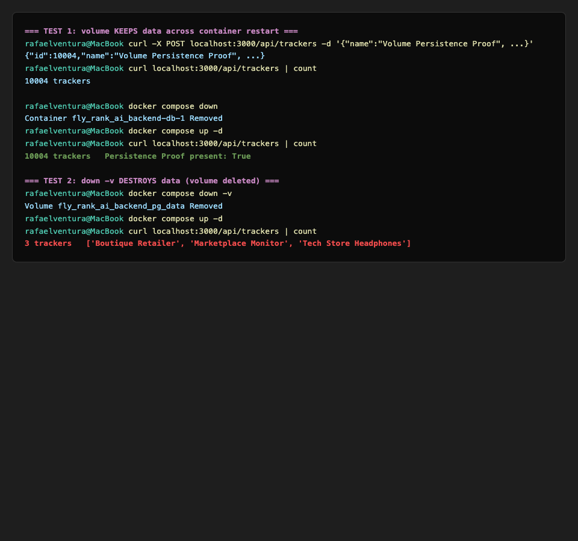
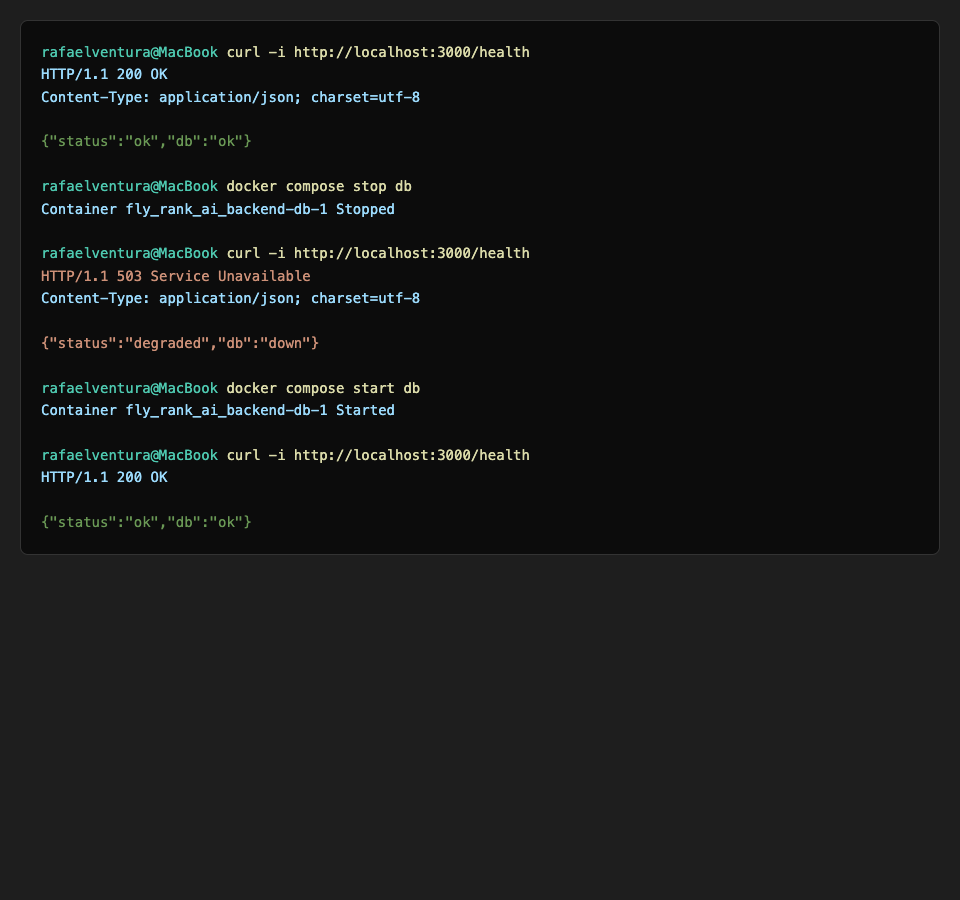
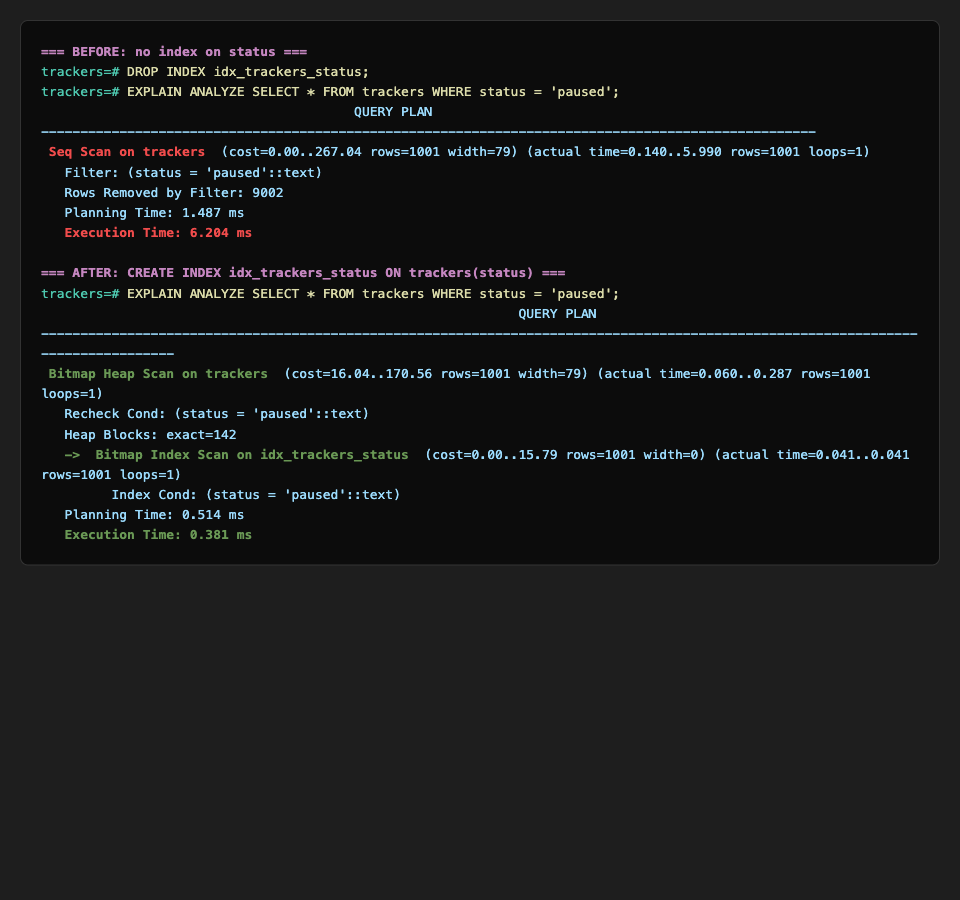
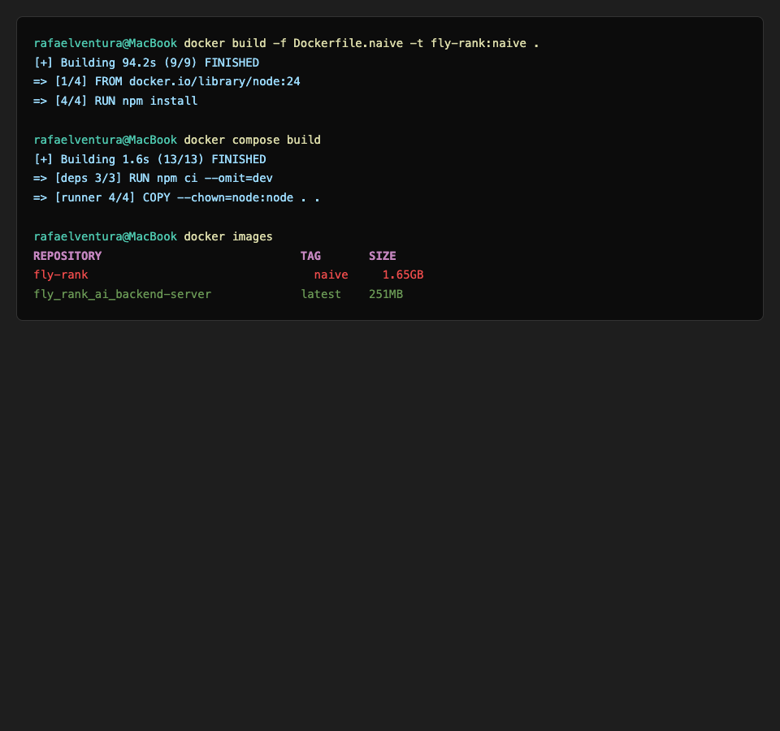
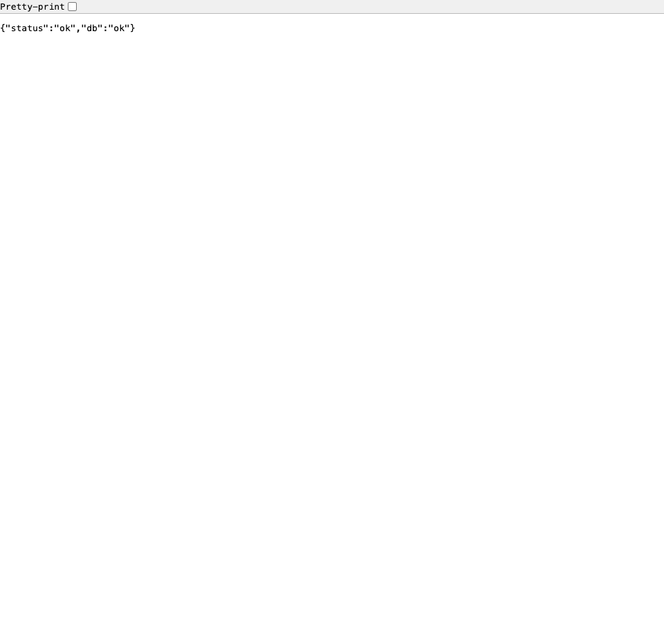
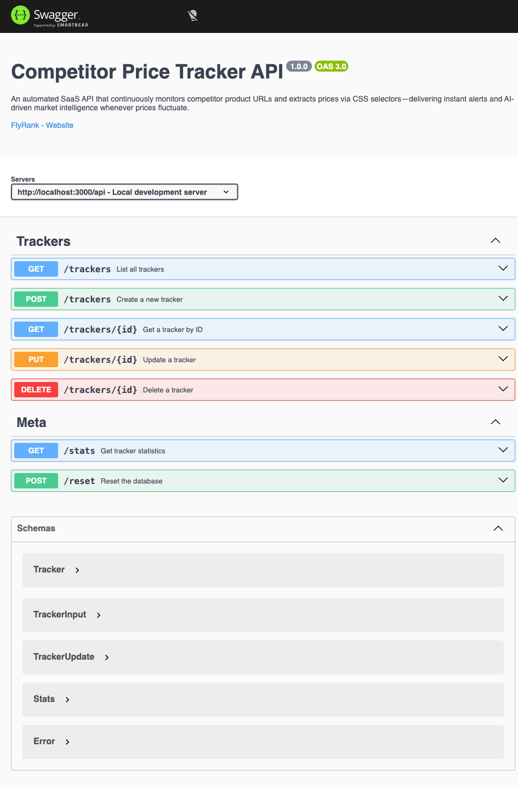

# Competitor Price Tracker API

An automated, lightweight SaaS API that continuously monitors competitor product URLs and extracts prices via CSS selectors — delivering instant alerts and AI-driven market intelligence whenever prices fluctuate.

## Business Proposal

**Problem:** E-commerce store owners, digital marketers, and pricing analysts waste hours manually visiting competitor websites daily to track price drops, stock updates, and promotional strategy shifts.

**Solution:** A RESTful API that lets users register competitor product URLs with CSS selectors, configure monitoring frequency, and manage tracking targets — all through a clean, layered MVC architecture.

**Target Audience:** E-commerce merchants, agency account managers, and market intelligence teams.

## Tech Stack

- **Runtime:** Node.js (ES Modules)
- **Framework:** Express 5
- **Documentation:** Swagger UI (OpenAPI 3.0)
- **Architecture:** Controller → Service → Repository (MVC Layered)
- **Storage:** PostgreSQL 17 (containerized, persistent via named volume)
- **Infrastructure:** Docker + Docker Compose (multi-stage build)

## Quick Start

The entire stack — app + database — starts with a single command:

```bash
# 1. Copy the example env file and fill in your values
cp .env.example .env

# 2. Build and start everything (app + Postgres)
docker compose up -d --build
```

The API is available at `http://localhost:3000`. Postgres runs in its own container with a persistent named volume, so your data survives restarts.

- **API base URL:** `http://localhost:3000/api/trackers`
- **Swagger UI:** `http://localhost:3000/docs`
- **Health check:** `http://localhost:3000/health`

### Useful commands

```bash
docker compose up -d          # start (reuses existing image)
docker compose up -d --build  # start and rebuild the app image (use after code changes)
docker compose down           # stop and remove containers (keeps the volume → data preserved)
docker compose down -v        # stop, remove containers AND the volume (data destroyed → re-seeds on next start)
docker compose logs server    # view app logs
docker compose ps             # view container status
```

## Architecture

```text
src/
├── controllers/
│   └── trackerController.js    # Receives HTTP requests, calls Service, returns status codes
├── services/
│   └── tracker.Service.js      # Business rules & validation
├── repositories/
│   └── tracker.Repository.js   # Executes SQL queries against PostgreSQL
├── routes/
│   ├── trackerRouter.js        # Tracker CRUD URL paths & HTTP verbs
│   └── metaRouter.js           # Meta endpoints: /health, /stats, /reset
├── middlewares/
│   └── errorHandler.js         # Centralized error handling
├── error.js                    # Custom error classes (ValidationError, NotFoundError)
└── app.js                      # Express app configuration

db/
├── pool.js                     # pg connection pool (reads DATABASE_URL from env)
└── tracker.db.js               # Creates table, indexes, seeds 3 trackers on first run
```

### Container topology

```text
┌─────────────────────────────────────────────┐
│  Docker Compose network                     │
│                                             │
│  ┌──────────────┐      ┌─────────────────┐  │
│  │   server     │─────▶│      db         │  │
│  │  (Node app)  │ 5432 │  (Postgres 17)  │  │
│  │  port 3000   │      │  volume: pg_data│  │
│  └──────────────┘      └─────────────────┘  │
│        │                                    │
│   depends_on: db (service_healthy)          │
└─────────────────────────────────────────────┘
        │
   localhost:3000 (published to host)
```

The `server` service reaches Postgres by the service name `db` (Compose's internal DNS), not `localhost`. The app only starts after Postgres passes its `pg_isready` healthcheck, eliminating the cold-start race condition.

## Endpoint Reference

| CRUD Operation | Method | Endpoint | Success Status | Error Status |
| --- | --- | --- | --- | --- |
| Read All | GET | `/api/trackers` | 200 OK | 500 Server Error |
| Read Single | GET | `/api/trackers/:id` | 200 OK | 404 Not Found |
| Create | POST | `/api/trackers` | 201 Created | 400 Bad Request |
| Update | PUT | `/api/trackers/:id` | 200 OK | 400 Bad Request / 404 Not Found |
| Delete | DELETE | `/api/trackers/:id` | 204 No Content | 404 Not Found |
| Health | GET | `/health` | 200 OK (db up) / 503 (db down) | — |
| Stats | GET | `/stats` | 200 OK | — |
| Reset | POST | `/reset` | 200 OK | — |
| Swagger UI | GET | `/docs` | 200 OK | — |

`GET /api/trackers` also supports optional query parameters: `?status=active|paused` (SQL `WHERE` filter) and `?search=keyword` (SQL `ILIKE` on the name, case-insensitive).

## Sample curl Output

### GET /api/trackers — List all trackers

```bash
curl -i http://localhost:3000/api/trackers
```

```http
HTTP/1.1 200 OK
Content-Type: application/json; charset=utf-8

[
  {"id":1,"name":"Tech Store Headphones","url":"https://site1.com/p1","targetSelector":".price","frequency":"daily","status":"active"},
  {"id":2,"name":"Marketplace Monitor","url":"https://site2.com/p2","targetSelector":"#price-tag","frequency":"hourly","status":"active"},
  {"id":3,"name":"Boutique Retailer","url":"https://site3.com/p3","targetSelector":"span.amount","frequency":"weekly","status":"paused"}
]
```

### GET /api/trackers/1 — Get single tracker

```bash
curl -i http://localhost:3000/api/trackers/1
```

```http
HTTP/1.1 200 OK
Content-Type: application/json; charset=utf-8

{"id":1,"name":"Tech Store Headphones","url":"https://site1.com/p1","targetSelector":".price","frequency":"daily","status":"active"}
```

### POST /api/trackers — Create a tracker

```bash
curl -i -X POST http://localhost:3000/api/trackers \
  -H "Content-Type: application/json" \
  -d '{"name":"New Tracker","url":"https://example.com/p1","targetSelector":".price"}'
```

```http
HTTP/1.1 201 Created
Content-Type: application/json; charset=utf-8

{"id":4,"name":"New Tracker","url":"https://example.com/p1","targetSelector":".price","frequency":"daily","status":"active"}
```

### DELETE /api/trackers/1 — Delete a tracker

```bash
curl -i -X DELETE http://localhost:3000/api/trackers/1
```

```http
HTTP/1.1 204 No Content
```

## Environment Variables

Secrets live in `.env` (git-ignored) and are injected into containers via Docker Compose's `${VAR}` interpolation — **no credentials are hardcoded in any committed file**.

Copy `.env.example` to `.env` and fill in the values:

```bash
PORT=3000
POSTGRES_USER=postgres
POSTGRES_PASSWORD=changeme
POSTGRES_DB=trackers
DATABASE_URL=postgres://postgres:changeme@db:5432/trackers
```

The `.env.example` file is committed with placeholder values so anyone can clone and run the project.

## Seed Data

On first run, the database is seeded with 3 trackers (only if the table is empty — restarting does not duplicate them):

| id | name | url | targetSelector | frequency | status |
| --- | --- | --- | --- | --- | --- |
| 1 | Tech Store Headphones | `https://site1.com/p1` | `.price` | daily | active |
| 2 | Marketplace Monitor | `https://site2.com/p2` | `#price-tag` | hourly | active |
| 3 | Boutique Retailer | `https://site3.com/p3` | `span.amount` | weekly | paused |

The three seed inserts run inside a single **transaction**, so seeding is all-or-nothing. Two indexes are also created on startup: `idx_trackers_status` and `idx_trackers_name`.

## Database Access

Connect to the containerized Postgres from your host with any DB GUI (e.g. DBeaver, TablePlus):

| Field | Value |
| --- | --- |
| Host | `localhost` |
| Port | `5432` |
| Database | `trackers` |
| Username | `postgres` |
| Password | *(your `POSTGRES_PASSWORD` from `.env`)* |

Or use `psql` directly inside the container:

```bash
docker exec -it fly_rank_ai_backend-db-1 psql -U postgres -d trackers
```

---

# Optional Extras — Evidence & Rationale

The following sections document the optional extras completed for this assignment, each with its rationale and terminal/browser evidence.

## 1 · Volumes — Why They Exist (Mortality Experiment)

Postgres writes its data files to `/var/lib/postgresql/data` **inside the container's writable layer**, which is destroyed when the container is removed. Without a volume, `docker compose down` would wipe your tables and the app would re-seed from scratch every restart. A **named volume** mounts a host-managed directory onto that path, so the data files persist outside the container's lifecycle and survive `docker compose down`.

**The experiment:**

- **Test 1 — volume preserved:** created a tracker ("Volume Persistence Proof", id 10004), ran `docker compose down` (no `-v`), then `up`. All 10004 trackers survived with unchanged `created_at` timestamps — the volume kept the data.
- **Test 2 — volume destroyed:** ran `docker compose down -v` (the `-v` flag deletes the named volume), then `up`. The database reset to the 3 seed trackers only — the manually-created data was gone.



This is exactly why volumes exist: **containers are disposable, data is not.** The named volume (`pg_data`) decouples the data's lifetime from the container's lifetime.

## 2 · Real Health Check (`GET /health` with DB ping)

A naive health check that only returns `{"status":"ok"}` proves nothing — it tells you the Express process is alive, but not whether the app can actually reach its database. A **real health check** runs the cheapest possible DB round-trip (`SELECT 1`) and reports the database status separately, returning the correct HTTP status code so automated systems can act on it.

**Implementation** (repository → service → route, following the existing layered architecture):

```js
// repository: pingDb()
const pingDB = async () => {
    await pool.query('SELECT 1');
    return true;
}

// service: healthCheck() — never throws, returns a status object
const healthCheck = async () => {
    try {
        await trackerRepository.pingDB();
        return { status: 'ok', db: 'ok' };
    } catch (err) {
        return { status: 'degraded', db: 'down' };
    }
}

// controller: maps status → HTTP code
const statusCode = health.status === 'ok' ? 200 : 503;
res.status(statusCode).json(health);
```

**Why the 503 matters:** a load balancer or Kubernetes liveness probe only looks at the HTTP status code — it doesn't parse JSON. Returning `200` with `"db":"down"` in the body is invisible to automated checks. The `503 Service Unavailable` is what tells the orchestrator "stop routing traffic to this instance." This is what real companies gate deploys on.

**One critical bug this surfaced:** the `pg` connection pool emits `'error'` events on **idle clients** when the DB goes down — a separate event stream from query-time errors. Without a `pool.on('error', ...)` handler, Node treats it as an unhandled error and the entire process crashes before the health check can respond. Adding the handler to `db/pool.js` is what makes the 503 path reachable.



## 3 · Index Performance — EXPLAIN ANALYZE Before/After

The app filters trackers by `status` (`GET /api/trackers?status=paused`). Without an index, Postgres must scan **every row** to find matches (a sequential scan). An index on the `status` column lets Postgres jump straight to the matching rows.

**Setup:** seeded 10,000 bulk rows so the difference is measurable (on 3 rows, the planner correctly chooses a sequential scan even with an index — consulting the index costs more than just reading the tiny table).

**Before (no index):**
```
Seq Scan on trackers  (actual time=0.140..5.990 rows=1001 loops=1)
  Filter: (status = 'paused'::text)
  Rows Removed by Filter: 9002
  Execution Time: 6.204 ms
```

**After (`CREATE INDEX idx_trackers_status ON trackers(status)`):**
```
Bitmap Heap Scan on trackers  (actual time=0.060..0.287 rows=1001 loops=1)
  ->  Bitmap Index Scan on idx_trackers_status
  Execution Time: 0.381 ms
```

**Result: 6.204 ms → 0.381 ms ≈ 16x faster.** The query planner switched from `Seq Scan` (read all 10,003 rows, discard 9,002) to `Bitmap Index Scan` (consult the index, fetch only the 1,001 matching rows).



**Key takeaway:** indexes pay off at scale. On toy data they can be a net loss; the planner knows this and won't use them. Always verify with `EXPLAIN ANALYZE` on realistic data volumes.

## 4 · Slim Image — Multi-Stage Dockerfile

The production image uses a **multi-stage build**: one stage installs only production dependencies (`npm ci --omit=dev`), and a final slim stage copies only what's needed to run — the source and production `node_modules` — onto a minimal Alpine base. Dev dependencies, build tools, and npm cache never reach the shipped image.

**The comparison** (a naive single-stage build vs. the multi-stage build):

| Approach | Dockerfile | Size |
| --- | --- | --- |
| Naive | `FROM node:24` + `npm install` (all deps, Debian base) | **1.65 GB** |
| Multi-stage | `FROM node:24-alpine3.23 AS deps` → `AS runner` + `npm ci --omit=dev` | **251 MB** |

**~85% smaller.** The savings come from three compounding choices:
1. **Alpine base** (`node:24-alpine3.23` ~50 MB vs. Debian `node:24` ~350 MB)
2. **`npm ci --omit=dev`** — skips `devDependencies` (nodemon) entirely
3. **Multi-stage** — the deps stage's layer cache and any build artifacts are discarded; only the final `COPY --from=deps` output ships



Smaller images mean faster pulls, faster deploys, less disk, and a reduced attack surface (fewer packages = fewer potential vulnerabilities).

## 5 · Full-Stack Evidence — App & Swagger UI

The running application and its interactive API documentation, served from the containerized stack:




